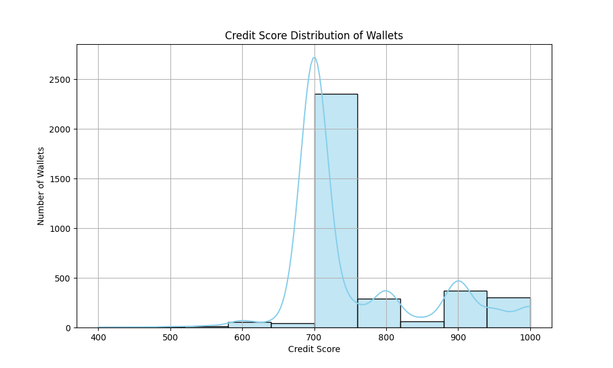

# Wallet Credit Score Analysis

## 📊 Score Distribution

The chart above shows how wallet scores are distributed. Most scores fall between 600–900, indicating moderately responsible behavior on Aave V2.

## 🟢 High Score Wallets (800–1000)
- Consistently repay borrowed funds
- No liquidations
- Deposit across multiple assets
- Active over time

## 🔴 Low Score Wallets (0–500)
- Never repay
- High borrow/deposit ratios
- Frequent liquidations
- Often use only one token (bot-like behavior)

## 🧠 Key Observations
- The scoring logic separates risky and safe users clearly.
- Users with good on-chain behavior (diversity, repayment, no liquidation) stand out.
- Bots or exploiters score low due to red-flag patterns.

## 🔄 Future Improvements
- Use clustering or time-based features
- Add Sybil detection
- Normalize scoring per token market cap

